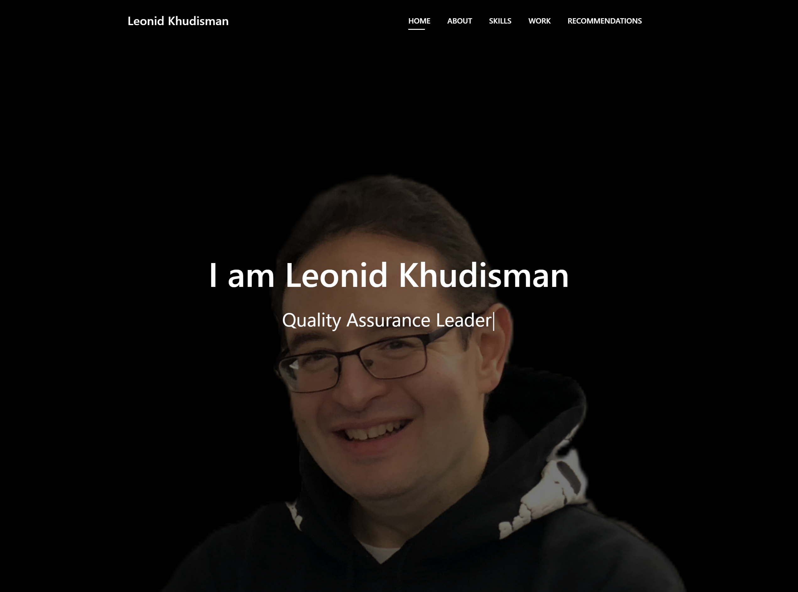

My Resume
============
This is a Bootstrap template designed to establish your professional online presence in a single location.



---
## Buy me a coffee

Whether you use this project, have learned something from it, or just like it, please consider supporting it by buying me a coffee, so I can dedicate more time on open-source projects like this :)

<a href="https://www.buymeacoffee.com/lkhudisman" target="_blank"></a>

---
## Demo

Go to https://lkhudisman.onrender.com/

---

## Contributing

#### Bug Reports & Feature Requests

Please use the [issue tracker](https://github.com/lkhudisman/my-resume/issues) to report any bugs or file feature requests.

#### Developing

PRs are welcome. To begin developing, do this:

```bash
$ git clone https://github.com/lkhudisman/my-resume.git
$ cd my-resume/
```

---

## License
>You can check out the full license [here](https://github.com/lkhudisman/my-resume/blob/master/LICENSE)

This project is licensed under the terms of the **MIT** license.
